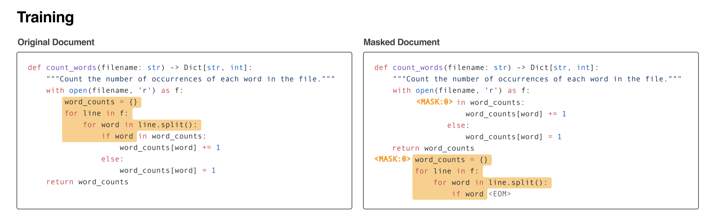

> codeLLM 算是 LLM 中最大的一个垂类应用，最近也有一些工作 focus 在 codeLLM 上，比如 StarCoder[^1] 等，从数据的收集到训练都有涉及。
>
> 和通常的 LLM training 相比，codeLLM 存在较多细节上的不同，这里按发表的时间，选择了 CodeParrot[^2], InCoder[^3], Santacoder[^4], StarCoder[^1] 和 CodeGen2[^5] 这几个模型，总结这些细节，方便以后查阅。

## Table of contents

## Data Collection

数据是 LLM 训练的基石，从数据的采集到清洗都非常重要，下面先从数据的收集开始总结不同模型的区别。

### CodeParrot

CodeParrot 使用的数据通过 Google 的 [BigQuery](https://cloud.google.com/blog/topics/public-datasets/github-on-bigquery-analyze-all-the-open-source-code) 来获取 GitHub dump，只从数据库中检索了所有小于 1MB 的 Python 文件，最终收集的数据集有 180GB，包含 20M 个文件。

### InCoder

InCoder 收集的数据主要包含两个数据来源：GitHub(GitLab) 和 StackOverflow。

#### GitHub(GitLab)

在 GitHub(GitLab) 中，一共收集了 28 种编程语言[^6]，所有收集的代码文件都遵循 permissive license，下面是不同编程语言的整体分布。

<div align=center>

</div>

代码文件和仓库的 **metadata**[^7] 通过 GitHub API 获取，截止于 2021-12-9。
收集 primary language 是 Python，JavaScript 和 Jupyter Notebook 的仓库，同时遵守 permissive license。

对于 repo 中的 code file，通过 extension，按照之前约定的 28 种编程语言进行选择。
另外也存在 primary language 不是 Python 的仓库，但是里面包含 Python 的代码文件，对于这种情况，通过 BigQuery 进行检索，收集所有 Python 和 Jupyter 代码文件。
经过后续处理之后，一共有 159GB 的代码文件，其中 Python 占 52GB。

#### StackOverflow

在 StackOverflow 上，收集 **Question, Answers and Comments**。
对于 StackOverflow 的数据，其 **metadata** 是 question tags(e.g., python, django), 和每个 question 和 answer 的点赞数。

对于所有的 question 来说，只收集至少有一个 answer 的问题，每个问题的 answer 按照分数排序，最多选 10 个，每个 question/answer 最多选 5 个 comments。
经过后续处理之后，一共有 57GB 的内容。

### SantaCoder

SantaCoder 使用的训练数据主要从 The Stack v1.1[^8] 中选择的 Python, Java 和 JavaScript 这三种编程语言，大小是 268GB。

### StarCoder

代码数据来自于 The Stack v1.2[^8]，一共包含 358 种编程语言，最终只选择了 86 种。

GitHub Issues 包含对话和对应的 action event(e.g., opening the issue, creating a comment)。每个 event 包含着作者的 username, message, action 和 creation date。

Git Commits 通过 BigQuery 来获取，对于 repositories 来说，包含里面单个代码文件的 commit 信息。

### CodeGen2

CodeGen2 使用的数据和 StarCoder 一模一样。

## Data Curation and Cleaning

除了 data cleaning 之外，curation 和 cleaning 也非常重要，他们决定的数据的质量。

### CodeParrot

主要参考了 OpenAI Codex[^9] 这篇论文进行去重和过滤。具体的过滤步骤如下：

1. 对于每个文件，去掉里面的空格，然后计算每个文件的 hash，进行精确去重；

```py
def get_hash(example):
    """Get hash of content field."""
    return {"hash": hashlib.md5(re.sub(PATTERN, "", example["content"]).encode("utf-8")).hexdigest()}
```

2. 使用 MinHash 和 Jaccard similarity 进行近似去重，首先通过 Jaccard 阈值 0.85 构造 duplicate cluster，然后对于每个 cluster，通过 Jaccard 阈值 1 进行精确去重[^10];
3. 过滤掉最大长度大于 1000 或者平均长度大于 100 或者字母字符占比小于 0.25 的文件；

```py
def line_stats(example):
    """Calculates mean and max line length of file."""
    line_lengths = [len(line) for line in example["content"].splitlines()]
    return {"line_mean": np.mean(line_lengths), "line_max": max(line_lengths)}

def alpha_stats(example):
    """Calculates mean and max line length of file."""
    alpha_frac = np.mean([c.isalnum() for c in example["content"]])
    return {"alpha_frac": alpha_frac}
```

4. 去掉自动生成的文件，前 5 行中包含 "auto-generated" 字段；

```py
def is_autogenerated(example, scan_width=5):
    """Check if file is autogenerated by looking for keywords in the first few lines of the file."""
    keywords = ["auto-generated", "autogenerated", "automatically generated"]
    lines = example["content"].splitlines()
    for _, line in zip(range(scan_width), lines):
        for keyword in keywords:
            if keyword in line.lower():
                return {"autogenerated": True}
    else:
        return {"autogenerated": False}
```

5. 以 0.7 的概率去掉前 5 行包含 "test file" 或者 "configuration file" 字样的文件，或者包含 "test" 和 "config" 的行比例超过阈值 0.05；

```py
def is_config_or_test(example, scan_width=5, coeff=0.05):
    """Check if file is a configuration file or a unit test by :
    1- looking for keywords in the first few lines of the file.
    2- counting number of occurence of the words 'config' and 'test' with respect to number of lines.
    """

    keywords = ["unit tests", "test file", "configuration file"]
    lines = example["content"].splitlines()
    count_config = 0
    count_test = 0
    # first test
    for _, line in zip(range(scan_width), lines):
        for keyword in keywords:
            if keyword in line.lower():
                return {"config_or_test": True}
    # second test
    nlines = example["content"].count("\n")
    threshold = int(coeff * nlines)
    for line in lines:
        count_config += line.lower().count("config")
        count_test += line.lower().count("test")
        if count_config > threshold or count_test > threshold:
            return {"config_or_test": True}
    return {"config_or_test": False}
```

6. 以 0.7 的概率去掉没有关键字 `def`, `for`, `while` 和 `class` 的文件；

```py
def has_no_keywords(example):
    """Check if a python file has none of the keywords for: funcion, class, for loop, while loop."""
    keywords = ["def ", "class ", "for ", "while "]
    lines = example["content"].splitlines()
    for line in lines:
        for keyword in keywords:
            if keyword in line.lower():
                return {"has_no_keywords": False}
    return {"has_no_keywords": True}
```

7. 过滤掉使用 `=` 少于 5 次的文件；

```py
def has_few_assignments(example, minimum=4):
    """Check if file uses symbol '=' less than `minimum` times."""
    lines = example["content"].splitlines()
    counter = 0
    for line in lines:
        counter += line.lower().count("=")
        if counter > minimum:
            return {"has_few_assignments": False}
    return {"has_few_assignments": True}
```

8. 过滤掉 tokenization 之后，字符数和 token 数比例小于 1.5 的文件(平均 ratio = 3.6)；

```py
def char_token_ratio(example):
    """Compute character/token ratio of the file with tokenizer."""
    input_ids = tokenizer(example["content"], truncation=False)["input_ids"]
    ratio = len(example["content"]) / len(input_ids)
    return {"ratio": ratio}
```

### InCoder

InCoder 的数据处理主要包括 Code 数据和 StackOverflow 数据。

对于 Code 数据，主要的流程是三个：Deduplication, Decontamination 和 Filtering。

**Deduplication**. 对于每个代码文件，使用精确去重删掉重复的文件，同时使用正则表达式来检测 email 地址，使用随机地址进行替换。

**Decontamination**. 这个步骤希望把测试集数据从训练集中去掉，会把 CodeSearchNet[^11] 中的 validation 和 test sets 中的 repo 从训练集中删掉。

**Filtering**. 这个步骤基本参考了 Codex 的流程，具体可以参考上面 CodeParrot 的部分。

对于 StackOverflow 的数据，没有再进行额外的数据处理了。

### SantaCoder

SantaCoder 的数据处理主要包括下面几个流程：

1. opt-out requests;
2. near-deduplication;
3. PII-redaction;
4. filtering(GitHub stars, Comment-to-code ratio);
5. decontaminated;

**opt-out requests**. 是指开发者提交请求之后，可以从数据集中删掉他们的代码。

**near-deduplication**. 这个部分基本从 CodeParrot 中借鉴过来，不过在 SantaCoder 中进一步研究了不同的 deduplication setting 是否更有效。从 the Stack v1.1 中采样 200k 的 Python 数据，调整不同的阈值来观察 FP 和 FN 的现象，最终确定了一组最好的超参，并用在了全量数据集上。

**PII-redaction**. 这个部分 SantaCoder 花了非常多的精力，相比于 InCoder 只是实验正则表达去替换邮箱地址，SantaCoder 训练了一个 PII 模型，主要对 Emails, IP 地址以及 keys 进行了检测，对于用户名和密码则是留给了后面的工作。

**filtering**. 这个部分的第一阶段和之前的工作类似，主要是基于长度和字符比例进行了过滤。第二阶段研究了基于 GitHub Star 和注释代码比进行过滤的效果。

对于 GitHub Star 来说，去掉 star 小于 5 的 repo 结果并不好，不管是 code completion 还是 fill-in-the-middle benchmark，结果都掉了很多。

对于 Comment-to-code ratio 来说，过滤掉高 ratio 的文件，最终有比较微弱的提升。

**decontaminated**. 这个部分和之前一样，就是把 benchmark 里面的数据从 training set 中去掉。

### StarCoder

相比于 SantaCoder, StarCoder 使用了更多的编程语言，同时使用了 GitHub issues 和 Git commits 进行训练。主要的数据处理分为下面几个部分：

1. Programming Languages;
2. Jupyter Notebooks;
3. GitHub Issues;
4. Git Commits;
5. Deduplication;

#### Programming Languages

**Selection of programming languages**. 基于文件的扩展名，从 The Stack 的 358 种编程语言中，选择了 86 种，选择的依据是 Githut2.0[^12] 和 2022 TIOBE Index[^13]。

**XML filter**. 发现一些特定的扩展名，如 `.sld` 包含超过 50% 的 XML 文件，通过对文件前 100 字符进行 `<?xml version=` 检查可以有效过滤这些文件。另外没有对 XSLT 做这种过滤，因为这种语言使用 XML 语法。

**Alpha filter**. 某些编程语言包含这大量的数据文件，比如 MATLAB，通过构造一个 alpha filter 过滤掉文件中字母比例小于 25% 的文件。
为了避免出现太多的 FP，只对 25 种数字出现最高的编程语言做这种过滤，同时再配合人工检查。

**HTML**. 设计一个 HTML filter 过滤掉大量的 HTML boilerplate 和 links。另外考虑到每个文件中可见文本[^14]的比例，只保留至少 20% 比例的 HTML 代码，同时可见文本的最小的长度是 100 个字符。

**JSON and YAML**. JSON 和 YAML 会包含更多的数据文件，为了移除他们，设计了下面的过滤策略。对于 YAML 文件，只保留 50-5000 字符数量，平均长度小于 100，最大长度小于 1000，超过 50% 的字母字符的文件。对于 JSON 文件，只保留 50-5000 字符数量，超过 50% 的字母字符的文件。

#### Jupyter Notebooks

Jupyter notebooks 会转化成两种不同的格式: Jupyter scripts 和 Jupyter structured。

**Jupyter scripts**. 利用 Jupytext[^15] 将 Jupyter notebooks 转化成 scripts，通过 metadata 确定编程语言，对于没有 metadata 的文件，使用 Guesslang[^16] 来确定编程语言。

**Jupyter structured**. 首先去掉不包含任何 Python 代码或者是 Markdown 文本的 notebook 文件，利用 metadata 来过滤掉 non-Python notebook，只有显示被标记为 Python 的 notebook 才会被保留。
对于每个 notebook，连续的 Markdown block 或者是 code block 都会被合并成一个 block，最终每个 notebook 都包含这 code-text pair。如果连续的 code block 都有输出，只保留最后一个 block 的输出，加到 code block 的后面，如果没有输出，会加上一个 special token `<empty_output>`。

#### GitHub Issues

GitHub issues 和 pull requests 都会被收集起来，每个对话包含这一系列的 action events，比如 opening the issue, creating a comment 或者 closing the issue。对于每个 event，会包含作者的 username, message, action 和 creation date。

对于 issues，包含下面这些处理流程。

1. 移除用户通过 email 回复 issue 时自动生成的文本，同时删掉小于 200 个字符的短信息。对于太长的信息，会截断到中间的 100 行，然后保留最后的 20 行。
2. 排除 bot 自动生成的 comments。
3. 将一个 issue 对话中，参与的用户数量作为评估这个 issue 质量的指标，如果参与的用户数量小于 2，会被移除。但是单用户的总字符数量小于 7000，也会被保留。另外对于单用户的 issue，如果里面的 events 超过 10 个，也会被移除，这通常是忽视的 bot 生成的 issue。
4. 最后会使用 fasttext library[^17] 来判断 issue 是否是英文，如果不是，会被移除。

#### Git Commits

Git commits 的处理流程如下表所示

<div align=center>

</div>

Commits 中改变的行相比于整个文件非常少，为了避免浪费太多的计算资源在复制内容上，只有 20% 的 commits 会保留整个文件，剩下 80% 的 commits 从第一个修改的行到最后一个修改的行采样一个 32 行的窗口。

#### Deduplication

这个部分基本 follow 了 SantaCoder 的过程，这个 [blogpost](https://huggingface.co/blog/dedup) 有更多的细节。near-dedup 应用在所有的编程语言和 Jupyter notebooks 上，但是 Git commits 没有做 near-dudep，也没有对 Github issues 做 near-dedup，论文强调 issues 不太会出现重复的情况[^18]。

#### Weighting of Data Sources

并没有做 re-weight，直接按照原始数据的比例进行采样，考虑到权重更大的编程语言意味着用的人多，就更重要。

#### PII Redaction

相比于 SantaCoder，StarCoder 做了更多的努力，替换检测到的 PII entities 成下面的 tokens:

```py
<NAME>, <EMAIL>, <KEY>, <PASSWORD>
```

#### Decontaminated

这个部分和 SantaCoder 基本一致，从训练集中去掉 Benchmark 中的数据。

### CodeGen2

CodeGen2 使用的数据和 StarCoder 完全一样。

## Data Formatting

这个部分主要是介绍数据在 feed 进模型之前，还需要额外做的一些处理，其中 CodeParrot 和 SantaCoder 都没有做任何处理，CodeGen2 没有具体描述是怎么做的，介绍一下 InCoder 和 StarCoder 的处理流程。

### InCoder

InCoder 的训练数据主要是 code 和 StackOverflow，下面分别介绍一下这两种数据的 format 流程。

**Code**. 代码文件的 meta 信息是 filename, file extension(proxy for lang), file source(GitHub or GitLab)，对于 GitHub repo，star 数会被分成 6 个 bucket。每个 meta 信息会以 1/2 的概率加在最开始，或者最后面，下面是两个例子：

```py
<| file ext=.py source=github |>
from typing import Dict

def count_words(filename: str) -> Dict[str, int]:
    """Count the number of occurrences of each word  in
    the file."""

    with open(filename, 'r') as f:
        word_counts = {}
        for line in f:
            for word in line.split():
                if word in word_counts:
                    word_counts[word] += 1
                else:
                    word_counts[word] = 1
    return word_counts
<|/ file filename=string_utils.py dstars=4>
```

```py
<| file ext=.ipynb:python |>
<text>
This notebook demonstrates using scikit-learn </text>
<cell>
%matplotlib inline
</cell>
<cell>
import numpy as np
import matplotlib.pyplot as plt
from sklearn.decomposition import PCA
</cell>
...
```

**StackOverflow**. StackOverflow 的 meta 信息是 question tags(e.g., python, django) 以及每个问题和回答的点赞数，会被分成 6 个 bucket。每个属性也是 1/2 的概率出现在前面或者后面，下面是一个例子：

```js
<| q tags=python,django |>
Django - How to display a form with user input

I'm trying to create a simple web application that can allow a user to enter a username and password.

Here's what I have so far:
<code>
from django.shortcuts import render
...
</code>
Can you help?
<|/ q dscore=3 |>
<| c |>
Why aren't you using the django authentication library?
<|/ c |>
<| a dscore=4 |>
You need to add your form to the template:
<code>
...
</code>
<| a tags=python,django |>
```

### StarCoder

StarCoder 的训练数据有几种不同的 source，下面分别介绍一下不同 source 的 format 流程。

**Code**. 会加入 repo name, file name 和 star 数量，其中 star 数量会分成 5 个 bucket，分别是 0, 1-10, 10-100, 100-1000, 1000+，这样做可以避免 overfit 具体的数量。
为了让模型对这些 meta 信息不敏感，每一项都以概率 0.2 独立增加，格式如下

```js
<reponame>REPONAME<filename>FILENAME<gh_stars>STARS\nCode<eos>
```

**Issues**. 会使用 sentinel token 来表示 issue 的状态，也会增加一个 special token 来区分 comments，userid 可以用来跟踪参与这个 issue 的用户数量，格式如下

```js
<issue_start>title + USERID: comment<issue_comment>USERID: Comment ... <issue_closed (optional)> <eos>
```

**Jupyter-scripts**. 这个和 code 的 format 格式一致。

**Jupyter-structured**. 会按照 text, code 和 output 的方式来排布，中间会用 sentinel tokens 来分割，格式如下

```js
<jupyter_start><jupyter_text>TEXT<jupyter_code>CODE <jupyter_output>OUTPUT<jupyter_text> ...
```

**Git commits**. 会用 sentinel tokens 来分割 code before commit, commit message 和 code after commit，由于 diff format 对于模型来说太难了，所以会使用全部的 code，格式如下

```js
<commit_before>code<commit_msg>text<commit_after>code<eos>
```

所有使用的 sentinel token 总结在下面的表中

| Token              | Description                   |
| ------------------ | ----------------------------- |
| `<\|endoftext\|>`  | end of text/sequence          |
| `<fim_prefix>`     | FIM prefix                    |
| `<fim_middle>`     | FIM middle                    |
| `<fim_suffix>`     | FIM suffix                    |
| `<fim_pad>`        | FIM pad                       |
| `<reponame>`       | repository name               |
| `<filename>`       | file name                     |
| `<gh_stars>`       | GitHub stars                  |
| `<issue_start>`    | start of GitHub issue         |
| `<issue_comment>`  | start of GitHub issue comment |
| `<issue_closed>`   | GitHub issue closed event     |
| `<jupyter_start>`  | start of Jupyter notebook     |
| `<jupyter_text>`   | start of Jupyter text cell    |
| `<jupyter_code>`   | start of Jupyter code cell    |
| `<jupyter_output>` | start of Jupyter output cell  |
| `<empty_output>`   | output cell without content   |
| `<commit_before>`  | code snippet before commit    |
| `<commit_msg>`     | commit message                |
| `<commit_after>`   | code snippet after commit     |

## Training Details

这个部分主要讲一下训练的一些细节，包括训练的方式，总的 token 以及 loss function 等等。

### CodeParrot

CodeParrot 总共训练 ~42B tokens(1ep)，数据集是 python-lang，训练的方式是标准的 AR，训练的配置如下：


### InCoder

InCoder 总共训练 ~52B tokens(1ep)，数据集是 multi-lang 和 StackOverflow 的问答数据，训练的方式是 causal masking object(infilling)，下面是一个例子



### SantaCoder

SantaCoder 总共训练了 ~118B tokens(1ep)，数据集是 python-lang, java-lang 和 javascript-lang，训练的方式是 AR 和 FIM，ctx_len 是 2k，使用 Multi-query Attention。

### StarCoder

StarCoder 总共训练了 1T tokens(~3.3ep)，数据集包含 86 种编程语言，使用 AR 和 FIM 的方式，ctx_len 是 8k，使用 Multi-query Attention。

### CodeGen2

CodeGen2 总共训练了 1.4T tokens(~5ep)，数据集和 StarCoder 一致，使用了 AR 和 FIM 进行训练，ctx_len 是 8k。

## Reference

[^1]: https://arxiv.org/abs/2106.06106
[^2]: https://github.com/huggingface/transformers/tree/main/examples/research_projects/codeparrot
[^3]: https://arxiv.org/pdf/2204.05999.pdf
[^4]: https://arxiv.org/pdf/2301.03988.pdf
[^5]: https://arxiv.org/pdf/2305.02309.pdf
[^6]: We include source files from C, C++, CSS, C#, Common Lisp, Dart, Forth, Go, HTML, Haskell, Java, JavaScript, Julia, Jupyter, Kotlin, Lua, Matlab, PHP, Perl, Python, R, Ruby, Rust, SQL, Scala, Shell, Swift, and TypeScript, although the great majority of files are Python and JavaScript.
[^7]: For code file, filename, file extension, file source (GitHub or GitLab). For repositories, the number of stars.
[^8]: https://huggingface.co/datasets/bigcode/the-stack#changelog
[^9]: https://arxiv.org/abs/2107.03374
[^10]: https://github.com/huggingface/transformers/blob/400e76ef11d94a12c255fe1a598966e1d6021511/examples/research_projects/codeparrot/scripts/minhash_deduplication.py#L209
[^11]: https://arxiv.org/pdf/1909.09436.pdf
[^12]: https://githut.info/
[^13]: https://web.archive.org/web/20221229040526/https://www.tiobe.com/tiobe-index/
[^14]: html 可见文本是指类似 `<p>...</p>` ，不包含 `<script>...</script>` 这种的文本
[^15]: https://jupytext.readthedocs.io/
[^16]: https://guesslang.readthedocs.io/
[^17]: The `lid.176.bin` version of this language identification model: https://fasttext.cc/docs/en/languageidentification.html
[^18]: 对这个问题存疑，issues 也有可能会存在重复的问题
