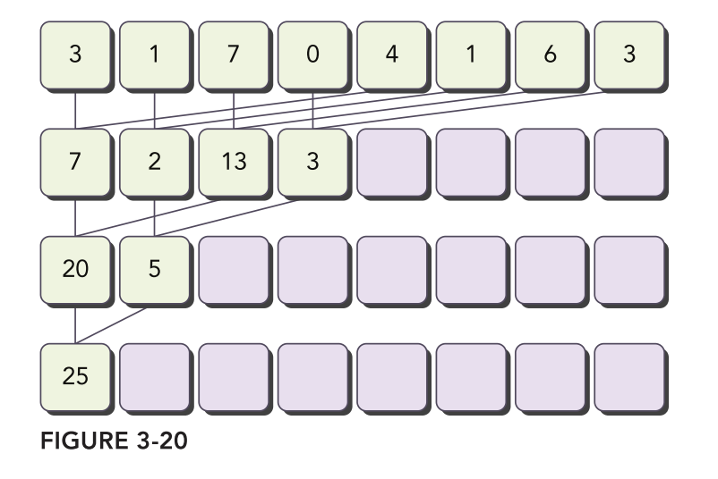

> Reduction is a classic problem in parallel computing. Given an array, the task is to compute its `sum`, `min`, `max`, or `mean`. This operation serves as a fundamental data-parallel primitive.
>
> While the naive approach involves using a for-loop to iterate through each element and compute the result, this method is not the most efficient. So, how can CUDA be employed to optimize this process?
>
> In this article, we will walk you through various optimization techniques to enhance your reduction code step by step.

## Table of Contents

## Introduction

Suppose you want to calculate the sum of an array containing `N` integers. While a simple for-loop could iterate through each element to compute the sum, this approach becomes inefficient for large arrays.

```c
int cpuSum(int* data, size_t size) {
  int sum = 0;
  for (int i = 0; i < size; ++i) {
    sum += data[i];
  }
  return sum;
```

To speed up the process, parallel computation is essential. Fortunately, addition is both associative and commutative, allowing us to sum the array elements in any order. Moreover, addition is a low-arithmetic-intensity operation, so optimizing for peak bandwidth is crucial.

One might think that synchronizing across all thread blocks would make it easy to reduce very large arrays.
In this scenario, a global sync could occur after each block produces its partial result. Once all blocks reach this sync point, the process could continue **recursively**, thereby significantly reducing the scale of the arrays involved.

However, global synchronization is not feasible in CUDA. Implementing such a feature in hardware would be costly, especially for GPUs with a high processor count. Additionally, requiring block synchronization would compel programmers to run fewer blocks to avoid deadlock, potentially reducing overall efficiency.

For **deadlock**, imagine a situation where some blocks start executing and reach the sync point, waiting for the other blocks to catch up. While others cannot start executing because GPU's resources are full occupied by the blocks are waiting for sync.

A common workaround to avoid the need for global synchronization is to use kernel decomposition. Kernel launches can effectively serve as global synchronization points, offering the advantage of negligible hardware overhead and low software overhead.

In this approach, the code for all levels remains consistent, and the kernel is invoked recursively. The input arrays are divided into smaller chunks, with each block responsible for calculating the partial sum of its respective chunk.
An example of kernel decomposition is shown below.


Next, let's walk you step by step through the optimization process.

## CPU Baseline

First, let's take a look at the CPU baseline version which is illustrated in the following figure.



The following code is a recursive implementation of the interleaved pair approach.

```c
int cpuReduceSum(int* data, size_t size) {
  // terminate check
  if (size == 1) return data[0];

  // renew the stride
  size_t stride = size / 2;

  // in-place reduction
  for (int i = 0; i < stride; ++i) { data[i] += data[i + stride]; }
  return cpuReduceSum(data, stride);
}
```

We can profile the baseline performance for 16M element reduction. We can get the following result.

```bash
./reducesum starting reduction at device 0: NVIDIA GeForce RTX 3090     with array size 16777216    grid 32768 block 512
cpu reduce elapsed 54.432869 ms, bandwidth 1.232874 GB/s, cpu_sum: 2139353471
```

## Reduction#1

```c
__global__ void reduceNeighbored(int* g_idata, int* g_odata, size_t n) {
  unsigned int tid = threadIdx.x;

  int idx = blockIdx.x * blockDim.x + threadIdx.x;
  if (idx >= n) return;

  int* i_data = g_idata + blockDim.x * blockIdx.x;

  for (int stride = 1; stride < blockDim.x; stride <<= 1) {
    // 2*stride threads execute
    if ((tid % (2 * stride) == 0)) { i_data[tid] += i_data[tid + stride]; }
    // synchronized within block
    __syncthreads();
  }
  if (tid == 0) g_odata[blockIdx.x] = i_data[0];
}
```

## Reference

- [Professional CUDA C Programming](https://www.amazon.com/Professional-CUDA-Programming-John-Cheng/dp/1118739329)
- [cuda webinar2](https://developer.download.nvidia.cn/assets/cuda/files/reduction.pdf)
- [避免分支分化](https://face2ai.com/CUDA-F-3-4-%E9%81%BF%E5%85%8D%E5%88%86%E6%94%AF%E5%88%86%E5%8C%96/)
- [循环展开](https://face2ai.com/CUDA-F-3-5-%E5%B1%95%E5%BC%80%E5%BE%AA%E7%8E%AF/)
